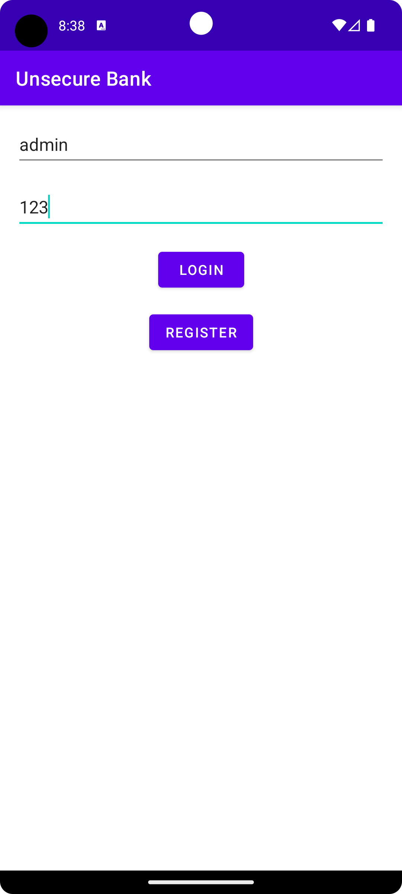
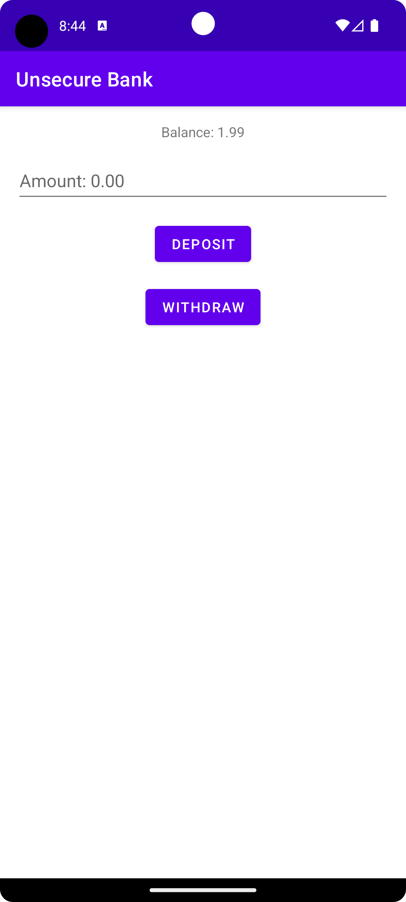
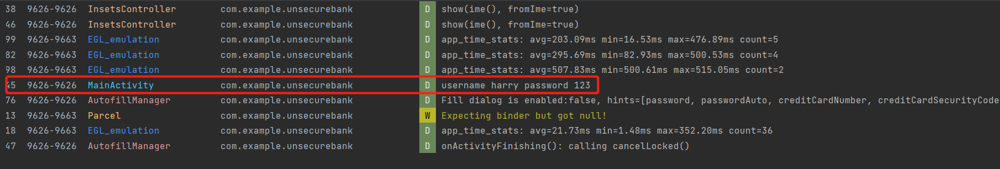
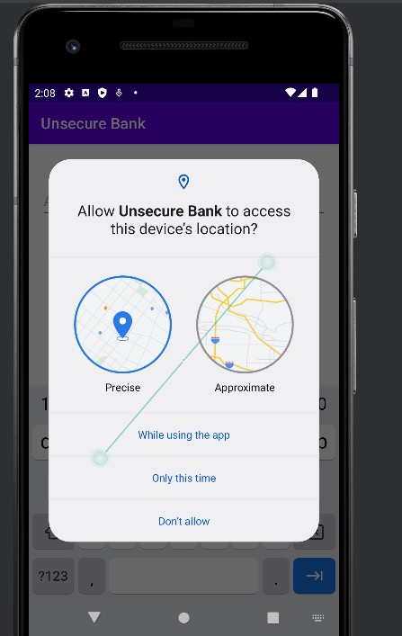

# Unsecure Bank

This is an intentionally unsecure bank Android app for the SWE 266P course at UCI.

## How to run

Install [Android Studio](https://developer.android.com/studio). Import the project. And then click run on the top right. Before sure to install the required JDK (JDK 17), Android SDK (Android 13), and emulator (Android 13) if applicable.

For JDK errors, you can go to Settings-Build, Execution, Deployment-Build Tools-Gradle-Gradle JDK, and then select the Android Studio bundled JDK.

**Note that all the numbers in the app have to follow the format 0.00, i.e. two decimals.**

## Injected Vulnerabilities

* Insecure data storage. The app data is saved locally by using `SharedPreferences`, which is not encrypted. Anyone with access to the file system or a rooted device and read and modify the app data. For example, the attacker might get the file from a path like `/data/data/com.example.unsecurebank/shared_prefs/BankApp.xml` and find entries like `<string name="123 password">456</string>`, which enables them to have unauthorized access. It's easier to find this file in Android Studio by going to the Device File Explorer on the bottom right and then going to the specified directory.


* Exported activities. The `BankingActivity` in the app have `android:exported="true"` in `AndroidManifest.xml`, which means the component can be accessed by components in other applications, as well as by the system itself. An attacker can bypass the login page and go to a user's banking page directly by creating a simple attacker app like below. You may also use the attacker app in the `/attacker` directory. (You'll need to register the user `123` first.)

    ```kt
    class MainActivity : AppCompatActivity() {
        override fun onCreate(savedInstanceState: Bundle?) {
            super.onCreate(savedInstanceState)
            setContentView(R.layout.activity_main)
            val intent = Intent(Intent.ACTION_VIEW)
            intent.data = Uri.parse("unsecurebank://exploit")
            intent.putExtra("username", "123")
            startActivity(intent)
        }
    }
    ```

* Hardcoded Admin Account. The hardcoded admin account in the app presents a significant security risk, as it allows anyone who enters the username "admin" alongside any password combination to bypass typical authentication and directly access the `BankingActivity`. This vulnerability can be easily exploited by an attacker who creates a simple application that supplies the username `admin` and a random password. Consequently, this bypasses the usual security checks, granting unrestricted access to privileged functions within the `BankingActivity`.

<p align="center">
 
</p>

  ```kt
    class MainActivity : AppCompatActivity() {
        private fun setListeners() {
            if (password == sharedPreferences.getString("$username password", "") || username == "admin") {
                val intent = Intent(this, BankingActivity::class.java)
                intent.putExtra("username", username)
                startActivity(intent)
                finish()
            } else {
                Snackbar.make(binding.root, R.string.wrong_username_or_password, Snackbar.LENGTH_SHORT).show()
            }
        }
    }
  ```

* Insecure Logging. Verbose logging that includes sensitive information such as usernames, passwords, or other personally identifiable information (PII) can enable attackers to obtain the information by looking at the log. When the user logs in, the username and password is printed in the log. You can see it in the Logcat.

    ```kt
        android:debuggable="true" // AndroidManifest.xml

        Log.d( "MainActivity", "username $username password $password") // MainActivity.kt
    ```

    

* Excessive permissions. After signing in, the app will ask the user for permission of user's location. Excessive permissions in Android apps can be a security risk: Privacy Invasion: Unneeded permissions can access and misuse private user data. Trust Issues: Users may avoid apps that request unnecessary permissions, or unknowingly risk their data by granting them. Expanded Attack Surface: More permissions mean more code that can be exploited by an attacker. Permission Leakage: Other apps may use an app's permissions to access data they shouldn't have access to. Potential Misuse: Even if not initially misused, granted permissions could be exploited in future app updates.

  
  ```kt
  private fun requestLocationPermission() {
        if (ContextCompat.checkSelfPermission(
                this,
                Manifest.permission.ACCESS_FINE_LOCATION
            ) != PackageManager.PERMISSION_GRANTED
        ) {
            ActivityCompat.requestPermissions(
                this,
                arrayOf(Manifest.permission.ACCESS_FINE_LOCATION),
                0
            )
        }
    }
  ```

## Secure Coding and Design Principles

* Principle of Least Privilege: Apart from the injected excessive permission, the app doesn't request or use any unnecessary Android permissions that could potentially expose sensitive user data or system resources. Each component has the minimum rights necessary to perform its designated tasks.
* Input Validation: Input validation is practiced in the app where the ViewModel validates username, password, and balance inputs based on certain rules, thereby mitigating the risk of injection attacks.
* Error Handling: The app has implemented proper error handling. For example, when an invalid input is encountered, it doesn't crash but instead provides feedback to the user through a Snackbar message.
* Code Readability and Maintenance: The app's code is modular and follows the Single Responsibility Principle, meaning each function has a single job. This makes the code easier to read and maintain.
* Secure Defaults: By using Android's SharedPreferences in MODE_PRIVATE, we ensure that the app's data is accessible only by your app by default. This is an example of a secure default setting.
* Defense in Depth: The app is not relying on only one security measure, but have layered several defenses. We are validating input and also restricting access to data with SharedPreferences.
* Minimization: The app has only the necessary components it needs to function, reducing the potential attack surface.
* Least Common Mechanism: The app avoids sharing components where possible. For example, each user has their own SharedPreferences for storing their balance and password, minimizing the potential risk from shared components.
* Principle of Complete Mediation: The app checks the validity of inputs every time it receives them, not just the first time. This is evident in the ViewModel where every input is passed through a validation check.
* Simplicity: The design of the app is quite simple and straightforward. This makes it easier to ensure that it is secure, as there are fewer components that can potentially be exploited.
* Secure Failure: When a failure happens, the app fails securely. For instance, if the login credentials are wrong, the user is not allowed access and is presented with a 'wrong username or password' message.

## Contributors

* Tianyao Chen (tianyc18@uci.edu)
* Peiming Chen (peimingc@uci.edu)
* Harry Wang (zhuoxuw2@uci.edu)
* Huikun Zheng (huikunz1@uci.edu)
