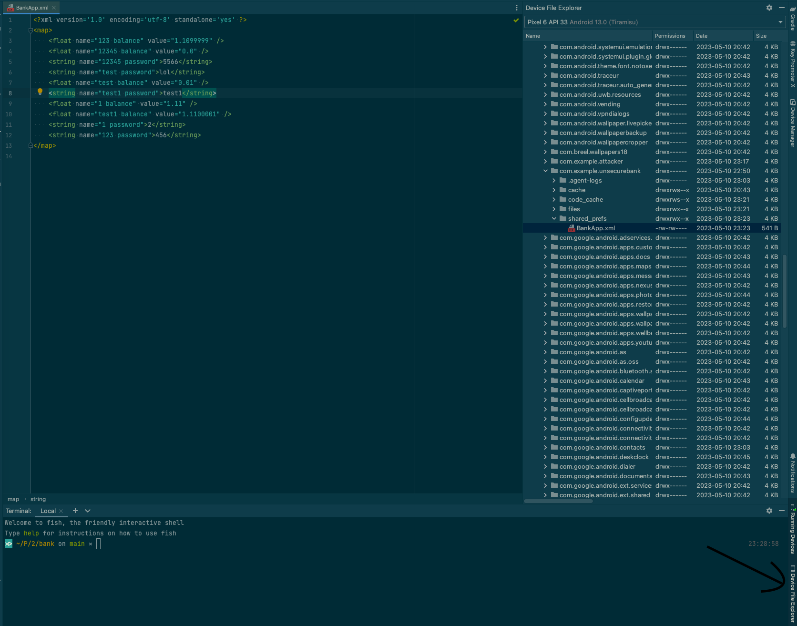

# Unsecure Bank

This is an intentionally unsecure bank Android app for the SWE 266P course at UCI.

## How to run

Install [Android Studio](https://developer.android.com/studio). Import the project. And then click run on the top right. Before sure to install the required JDK (JDK 11), Android SDK (Android 13), and emulator (Android 13) if applicable.

## Injected Vulnerabilities

* Insecure data storage. The app data is saved locally by using `SharedPreferences`, which is not encrypted. Anyone with access to the file system or a rooted device and read and modify the app data. For example, the attacker might get the file from a path like `/data/data/com.example.unsecurebank/shared_prefs/BankApp.xml` and find entries like `<string name="123 password">456</string>`, which enables them to have unauthorized access. It's easier to find this file in Android Studio by going to the Device File Explorer on the bottom right and then going to the specified directory.



* Exported activities. The `BankingActivity` in the app have `android:exported="true"` in `AndroidManifest.xml`, which means the component can be accessed by components in other applications, as well as by the system itself. An attacker can bypass the login page and go to a user's banking page directly by creating a simple attacker app like below. You may also use the attacker app in the `/attacker` directory. (You'll need to register the user `123` first.)

    ```kt
    class MainActivity : AppCompatActivity() {
        override fun onCreate(savedInstanceState: Bundle?) {
            super.onCreate(savedInstanceState)
            setContentView(R.layout.activity_main)
            val intent = Intent(Intent.ACTION_VIEW)
            intent.data = Uri.parse("unsecurebank://exploit")
            intent.putExtra("username", "123")
            startActivity(intent)
        }
    }
    ```

* // TODO: Peiming
* // TODO: Harry
* Excessive permissions. After signing in, the app will ask the user for permission of user's location. Excessive permissions in Android apps can be a security risk: Privacy Invasion: Unneeded permissions can access and misuse private user data. Trust Issues: Users may avoid apps that request unnecessary permissions, or unknowingly risk their data by granting them. Expanded Attack Surface: More permissions mean more code that can be exploited by an attacker. Permission Leakage: Other apps may use an app's permissions to access data they shouldn't have access to. Potential Misuse: Even if not initially misused, granted permissions could be exploited in future app updates.

  
  ```kt
  private fun requestLocationPermission() {
        if (ContextCompat.checkSelfPermission(
                this,
                Manifest.permission.ACCESS_FINE_LOCATION
            ) != PackageManager.PERMISSION_GRANTED
        ) {
            ActivityCompat.requestPermissions(
                this,
                arrayOf(Manifest.permission.ACCESS_FINE_LOCATION),
                0
            )
        }
    }
  ```

## Secure Coding and Design Principles

// TODO

## Contributors

* Tianyao Chen (tianyc18@uci.edu)
* Peiming Chen (peimingc@uci.edu)
* Harry Wang (zhuoxuw2@uci.edu)
* Huikun Zheng (huikunz1@uci.edu)
